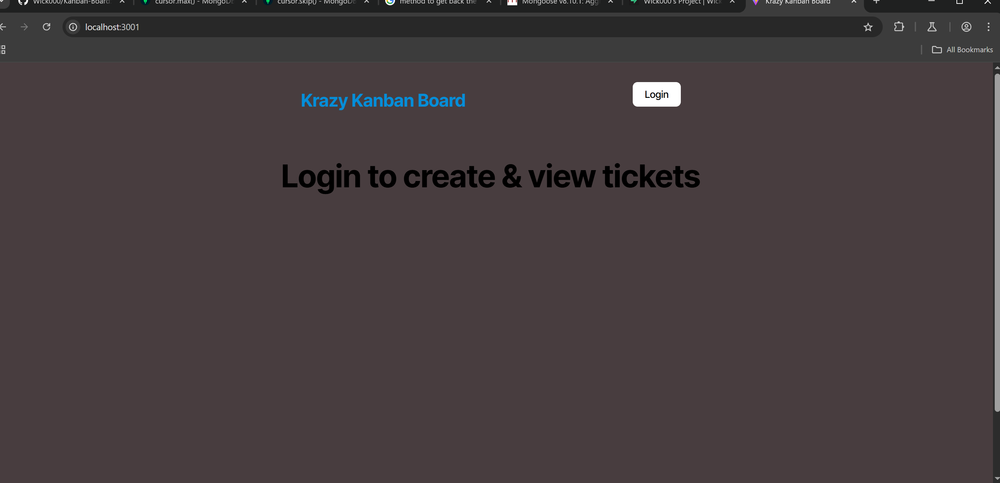
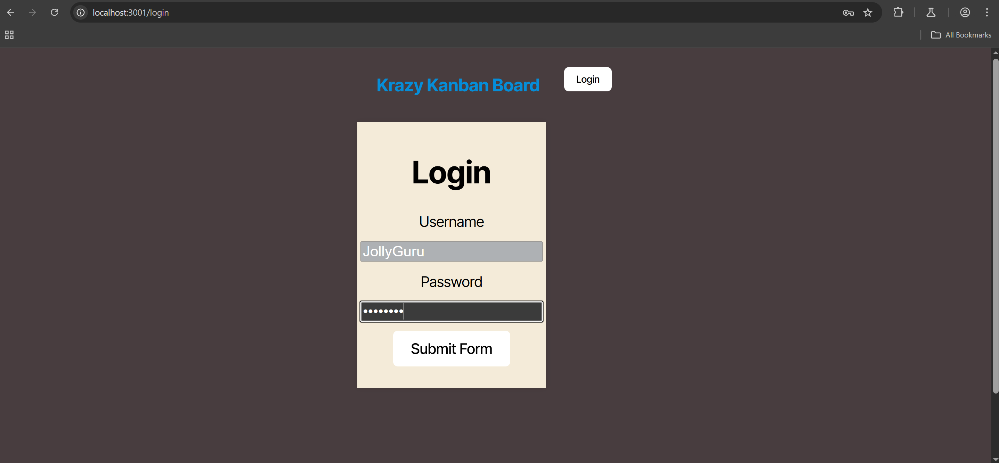
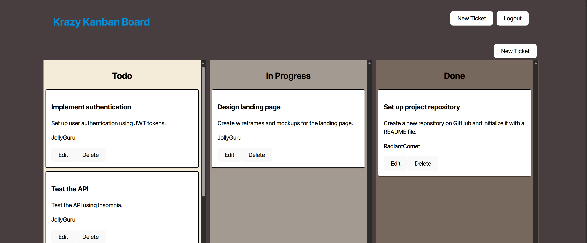
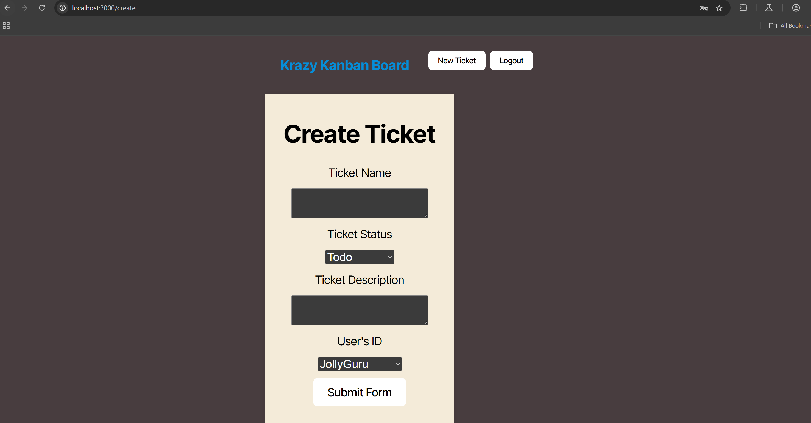

# Kanban Board


## Description

I added authentication with JWT to an existing Kanban board application for secure login.

## Table of Contents

- [Installation](#installation)
- [Usage](#usage)
- [License](#license)
- [Contributing](#contributing)
- [Screenshots](#screenshots)
- [Questions](#questions)

## Installation

Run the following command to install dependencies:

```
npm i
```

## Usage

Have pre seeded user name and login to use the app!


## License

This project is licensed under the MIT license. For more information, see [this link](https://opensource.org/licenses/MIT).

## Contributing

Email me about contributing!

## Screenshots






## Questions

If you have any questions, feel free to reach out to me at [wick9872000@yahoo.com](mailto:wick9872000@yahoo.com). You can also find me on GitHub at [Wick000](https://github.com/Wick000).
